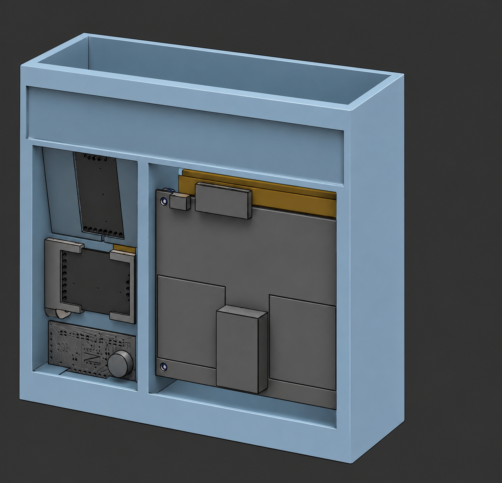

# PRGR Launch Monitor — Project Overview

## What This Is

The PRGR Launch Monitor is a DIY golf launch monitor — a device that measures what
happens to a golf ball (and the club) at the moment of impact and for the first few
feet of ball flight, then uses that data to calculate the full shot: carry distance,
total distance, launch angle, spin, ball speed, club speed, and smash factor.

It is built entirely on a **Raspberry Pi 5**, using a high-speed camera to see the
ball leave the tee and a set of Doppler radars to measure speed and angles. All
processing happens on the device — there is no phone app, no cloud service, and no
subscription. You hit a ball, and the numbers appear on the touchscreen.

The architecture is modeled after commercial units like the **Rapsodo MLM2 Pro**
(camera "Impact Vision" + radar sensor fusion), but assembled from off-the-shelf
sensors and open hardware at a fraction of the retail cost.

## What We're Trying to Achieve

### Primary goal
Produce **accurate, repeatable shot data** for a golfer practicing indoors or at a
range, using a device that:

1. **Detects the moment of impact** reliably (camera + radar + sound trigger)
2. **Measures ball speed and club speed** (Doppler radar)
3. **Measures launch angle and club path** (twin radars at different orientations)
4. **Detects ball spin** (high-FPS camera watching fiducial-marked balls leave the tee)
5. **Fuses all sensor inputs** into a single confident shot reading
6. **Calculates carry and total distance** via a ballistics model
7. **Presents it all** on a fast, touch-first 800×480 screen

### Design principles
- **On-device only** — no external dependencies at runtime. The Pi does everything.
- **Sensor fusion over any single source** — the camera, the three radars, and the
  sound trigger cross-check each other. Speed from radar, spin from the camera, angle
  from the vertical radar; each sensor covers another's weakness.
- **Touch-first UI** — designed for a golfer standing at a mat, glancing at the screen
  between shots. Big numbers, minimal taps, works with gloves.
- **Development Mode everywhere** — every screen and feature works with simulated data
  so the UI can be built and tested without any hardware attached.

### Current phase (as of 2026-07-01)
The software foundation is in place — the camera capture pipeline runs at high FPS, the
ball-zone state machine detects when a ball is present and when it leaves, and intrinsic
camera calibration (checkerboard) is implemented. **No physical geometry has been
validated on hardware yet.** The immediate priority is getting the **radars working
first**, then using real radar behavior to drive the rest of the physical setup — see
the sequence below.

### Development Sequence (order of operations)

The physical geometry of the build is **not** being guessed up front. It will be
established empirically, in this order:

1. **Get the radars working** — OPS243-A + 2× K-LD7 (with the OpenFlight-vendored Python
   drivers). Prove we can read ball speed, club speed, launch angle, and club path.
2. **Establish the radars' accurate range** — determine the **maximum distance** at which
   the radars still return accurate, trustworthy data. This becomes the anchor constraint
   for where everything else sits.
3. **Incorporate the impact camera** — only once the radar working distance is known do we
   introduce the camera, then work out **how far the ball needs to be** so that:
   - the ball's **pixel diameter** is large enough for reliable spin/impact detection,
   - the camera's field of view still covers the departure path,
   - the camera distance is compatible with the radar's accurate range.
4. **Calibrate and measure** — with a real, fixed geometry, run intrinsic/extrinsic
   calibration, confirm the ball's actual pixel size, and lock in the true distances.

> 📌 The **~5 ft** figure and the **8 mm lens** pairing are the _starting hypothesis_ for
> step 3, not a settled fact. Expect these numbers to change once real radar range and
> real camera pixel-size data are in hand.

---

## Hardware

### Compute & Display

| Component | Spec | Role |
|---|---|---|
| **[Raspberry Pi 5](https://www.raspberrypi.com/products/raspberry-pi-5/)** | 8 GB RAM, quad-core Arm Cortex-A76 @ 2.4 GHz, aarch64 | All processing on-device: camera pipeline, ball detection, sensor fusion, UI |
| **[Waveshare 5" DSI LCD](https://www.waveshare.com/5inch-dsi-lcd.htm)** | 800 × 480 IPS, DSI interface @ 60 Hz, 5-point capacitive touch, 6H tempered glass, ~1.2 W | The entire user interface (Qt 6 / QML) |
| **microSD / storage** | Raspberry Pi OS Bookworm (64-bit) | OS, application binary, shot history, calibration data |

**Display details.** The [Waveshare 5inch DSI LCD](https://www.waveshare.com/5inch-dsi-lcd.htm)
is a driver-free plug-and-play panel with a native **800 × 480** resolution — which the
entire PRGR UI targets exactly, so there is **no scaling** and every pixel maps 1:1. It
connects over the **DSI ribbon** (not HDMI), supports **5-point capacitive touch** through
a tempered-glass surface, and draws only ~1.2 W. Software backlight brightness control is
supported. See the [Waveshare wiki](https://www.waveshare.com/wiki/5inch_DSI_LCD) for setup.

> ⚠️ **Pi 5 cable gotcha:** the Raspberry Pi 5 changed its DSI/CSI connector to the smaller
> 22-pin FPC. This panel needs the correct adapter cable for the Pi 5 — the
> **[Waveshare Pi5-Display-Cable-200mm](https://www.waveshare.com/pi5-display-cable-200mm.htm)**
> (or the official Raspberry Pi DSI cable for Pi 5). The cable that ships in the box is for
> older Pi models with the 15-pin connector.

**Related display variants** (same 800 × 480, if you ever swap panels):
- [5inch Capacitive IPS Touch Display (Type B)](https://www.waveshare.com/5inch-dsi-lcd-b.htm) — lower power consumption variant
- [5inch DSI Display, IPS, touch optional](https://www.waveshare.com/50h-800480-ips.htm) — thin/light design
- [5inch Display, DPI Interface, IPS, No Touch](https://www.waveshare.com/5inch-lcd-for-pi.htm) — non-touch DPI variant

### Impact Camera

The single most important sensor for spin detection. It watches the ball for the first
few feet of departure at very high frame rates.

| Attribute | Spec |
|---|---|
| **Sensor** | OmniVision **[OV9281](https://www.arducam.com/product/arducam-ov9281-1mp-global-shutter-mipi-camera-modules-for-raspberry-pi/)** — global shutter, monochrome, 1 MP |
| **Native resolution** | 1280 × 800 |
| **Pixel pitch** | 3.0 µm |
| **Sensor size** | 3.84 mm × 2.40 mm |
| **Lens** | 8 mm F1.2 IR-corrected M12 |
| **Interface** | CSI (camera serial interface) via libcamera / rpicam-vid |
| **Orientation** | Rotated **90° clockwise (portrait)** to maximize vertical coverage of the ball's departure path |
| **Distance from ball** | _**TBD** — ~5 ft is a proposed test target, **not yet validated** (as of 2026-07-01). The real distance will be derived from radar range + camera pixel-size needs (see [Development Sequence](#development-sequence-order-of-operations))_ |
| **Preview mode** | 640 × 480 @ 180 FPS |
| **Capture mode** | 640 × 400 @ 240 FPS |
| **Expected ball size** | _~75 px diameter at 5 ft with the 8 mm lens (theoretical, per the pinhole model — to be confirmed on hardware)_ |
| **Manuals** | [OV9281 sensor datasheet](https://www.ovt.com/products/ov9281/) · [Arducam OV9281 for Pi (product + docs)](https://www.arducam.com/product/arducam-ov9281-1mp-global-shutter-mipi-camera-modules-for-raspberry-pi/) · [libcamera / rpicam-vid docs](https://www.raspberrypi.com/documentation/computers/camera_software.html) |

**Why global shutter?** A global-shutter sensor exposes every pixel at the same instant.
A rolling shutter (found in most cheap cameras) exposes row by row, which smears and
skews a fast-moving ball. For measuring spin and speed at impact, global shutter is
non-negotiable.

**Why monochrome + IR?** Mono sensors have no color filter, so every pixel collects
light — critical for fast, short exposures that freeze motion. The IR-corrected lens
keeps the image sharp under infrared illumination.

#### Impact camera lens (8 mm F1.2 M12)

The lens paired with the OV9281 for spin/impact capture. Fixed iris, manual focus,
IR-corrected ("day/night") so it stays sharp under IR illumination.

| Attribute | Value |
|---|---|
| **Focal length** | 8 mm |
| **Aperture** | F1.2 (fixed iris) |
| **Mount** | M12 |
| **Field of view (D × H × V)** | 50° × 41° × 31° |
| **Minimum object distance (M.O.D.)** | 0.2 m (20 cm) |
| **Back focal length (BFL)** | 6.58 mm |
| **Lens construction** | 7 elements in 6 groups, aluminum-alloy barrel |
| **IR correction (day/night)** | Yes |
| **Focus / Zoom** | Manual focus, fixed zoom |
| **Dimensions** | Ø16 mm × 30.2 mm |
| **Operating temperature** | −20 °C to +80 °C |

> 📌 The **31° vertical FOV** and **0.2 m minimum focus** are the numbers that matter for
> step 3 of the development sequence — they set how much of the ball's departure path the
> camera covers at a given distance, and how close the camera can physically sit. The
> **F1.2** aperture is what makes the microsecond exposures possible under indoor lighting.

### Radar (planned integration)

Three Doppler radar modules provide speed and angle data, cross-checking the camera.
Drivers are vendored from the OpenFlight project (Python), then bridged to the C++ app.

| Module | Frequency | Interface | Role | Manuals |
|---|---|---|---|---|
| **OPS243-A** | 24.125 GHz | USB / UART / RS-232 | Ball speed, club speed, spin backup (I/Q) | [Product](https://omnipresense.com/product/ops243-doppler-radar-sensor/) · [API (AN-010)](https://omnipresense.com/wp-content/uploads/2025/10/AN-010-AD_API_Interface.pdf) · [User Manual](https://fcc.report/FCC-ID/2ALLL243A/4525695.pdf) |
| **K-LD7 #1 (vertical)** | 24.05–24.25 GHz | UART (3.3 V) | Launch angle (vertical) | [Product](https://rfbeam.ch/product/k-ld7-radar-transceiver/) · [Datasheet](https://www.mouser.com/datasheet/2/1565/K_LD7_Datasheet-3446777.pdf) |
| **K-LD7 #2 (horizontal)** | 24.05–24.25 GHz | UART (3.3 V) | Club path / aim (horizontal) | [Product](https://rfbeam.ch/product/k-ld7-radar-transceiver/) · [Datasheet](https://www.mouser.com/datasheet/2/1565/K_LD7_Datasheet-3446777.pdf) |

#### OPS243-A — full specs
| Attribute | Value |
|---|---|
| **Type** | K-band Doppler (motion + speed + direction) radar |
| **Operating frequency** | 24.125 GHz (K-band, FCC/CE certified) |
| **Detection range** | 1 m – 100 m (object dependent) |
| **Speed reporting** | up to 348 mph (velocity via Doppler shift) |
| **Direction** | inbound / outbound |
| **Beam width (−3 dB)** | ~20° × 24° |
| **Interfaces** | USB, UART, RS-232 |
| **Default UART** | 8 data bits, no parity, 1 stop bit, 19,200 baud |
| **Raw data** | exposes **I/Q** samples — the reason this radar was chosen (needed for spin/impact buffer) |
| **Operating temp** | −40 °C to +85 °C |
| **Manuals** | [Product page](https://omnipresense.com/product/ops243-doppler-radar-sensor/) · [AN-010 API Interface (serial commands)](https://omnipresense.com/wp-content/uploads/2025/10/AN-010-AD_API_Interface.pdf) · [UM-003 User Manual](https://fcc.report/FCC-ID/2ALLL243A/4525695.pdf) |

#### K-LD7 (×2) — full specs
| Attribute | Value |
|---|---|
| **Type** | 24 GHz fully-digital Doppler radar transceiver (speed, direction, distance, **angle**) |
| **Operating frequency** | 24.05 – 24.25 GHz (ISM band) |
| **Supply voltage** | 3.2 V – 5.5 V |
| **Current draw** | ~20 – 60 mA (depends on speed-range setting) |
| **Antenna** | 3 × 4 patch array, asymmetrical beam |
| **On-board DSP** | target list with speed, direction, distance, and angle; built-in tracking filter |
| **Serial interface** | UART — used at **3 Mbaud** in this project for fast readout |
| **Operating temp** | −40 °C to +85 °C |
| **Roles** | one oriented for **vertical** angle (launch angle), one for **horizontal** angle (club path) |
| **Manuals** | [Product page](https://rfbeam.ch/product/k-ld7-radar-transceiver/) · [Datasheet + communication protocol (PDF)](https://www.mouser.com/datasheet/2/1565/K_LD7_Datasheet-3446777.pdf) |

> ⚠️ **Hardware notes for radar:**
> - Buy the **OPS243-A**, *not* the OPS243-A-W (WiFi) — the WiFi version's baud rate is
>   too slow to stream I/Q data.
> - The K-LD7 modules require **3.3 V** FTDI USB-serial adapters. A 5 V adapter will
>   **damage** the module.
> - The K-LD7 tops out at 5.5 V supply — do not power it from a 12 V rail.

### Impact Trigger (under evaluation — may be dropped)

| Component | Spec | Role | Manuals |
|---|---|---|---|
| **SparkFun SEN-14262 Sound Detector** | Analog + gate + envelope outputs; preamp gain adjustable via **R17** (default gain 100 / 20 dB); populate R17 to reduce gain for 3.3 V operation | Detects the *sound* of impact to trigger the radar's rolling I/Q buffer capture | [Product](https://www.sparkfun.com/products/14262) · [Hookup Guide](https://learn.sparkfun.com/tutorials/sound-detector-hookup-guide/all) |

> 🤔 **Is the sound trigger even needed?** OpenFlight uses it to mark the *exact instant* of
> impact so the correct slice of the OPS243-A rolling I/Q buffer can be captured. But PRGR
> has **two other impact markers** already: the **radar** (a sudden speed-threshold crossing)
> and the **camera** (`IMPACT_DETECTED` from the ball-zone state machine). The sound trigger's
> only real advantage is sub-frame **timing precision**. **Current plan:** start with
> radar/camera triggering and treat the sound detector as **optional** — add it later *only*
> if the I/Q capture window proves hard to hit without it. Acoustic triggering in a bay has
> real downsides (false triggers from mat noise, other players, reflections; the R17 tuning)
> that aren't worth it unless the timing precision proves genuinely necessary.

> 📌 **On the R17 mod (if the sound trigger is used):** R17 is an unpopulated resistor footprint that sets the preamp
> gain. Per the [SparkFun hookup guide](https://learn.sparkfun.com/tutorials/sound-detector-hookup-guide/all),
> populating R17 (e.g. ~33–47 kΩ) in parallel with R3 lowers the gain so the detector
> isn't permanently saturated at 3.3 V — otherwise the GATE output can stay latched high
> and never register a distinct impact. Tune the exact value if the gate LED stays lit
> without sound.

### Approximate cost of the radar add-on

~$412 for the OPS243-A, two K-LD7 modules, two 3.3 V FTDI adapters, the sound detector,
and wiring — assuming you already have the Pi 5, touchscreen, and impact camera.

### Power

The Raspberry Pi 5 is power-sensitive. It needs a **5 V / 5 A (25 W)** USB-C source that
performs a proper Power Delivery (PD) handshake. **Without that handshake the Pi 5 caps
total USB current to 600 mA**, which starves the three-radar array and causes capture
failures. A genuine 5 A supply unlocks the Pi's **~1.6 A USB budget** — the amount needed
to run the OPS243-A + 2× K-LD7 simultaneously. *(This limitation is well-documented by the
OpenFlight project, whose Pi 5 + triple-radar + touchscreen stack is the same as ours.)*

Three ways to power the build:

| Scenario | Source | Notes |
|---|---|---|
| **Bench / indoor** | [Official Raspberry Pi 27 W USB-C PD](https://www.raspberrypi.com/products/27w-power-supply/) (5 V / 5 A) | The reference standard. Guarantees the PD handshake and full USB budget. |
| **Mobile / range (simple)** | A 5 V / 5 A PD-compliant USB-C power bank (25 W EPR) | Must actually advertise **5 V / 5 A**, not just "25 W" at higher voltages. |
| **Integrated tower (our build)** | [TalentCell PB120B1](https://talentcell.com/lithium-ion-battery/12v/pb120b1.html) (12 V, 142 Wh) → 12 V-to-5 V/5 A USB-C buck converter | Self-contained battery for a tower enclosure. See below. |

#### The tower / TalentCell approach

For a self-contained tower we use a **TalentCell PB120B1** — a 12 V lithium pack,
**38,400 mAh / 142 Wh**, 3s4p 18650 cells, with a **12 V / 6 A DC** output and a
5 V / 2.4 A USB output. Wiring it correctly matters:

- ⚠️ **Do NOT power the Pi 5 from the TalentCell's own 5 V USB port** — it's only **2.4 A**,
  below the Pi 5's requirement, and it does **not** do a PD handshake.
- Instead, feed the **12 V DC output** (up to 72 W available) into a **12 V → 5 V / 5 A
  USB-C buck converter** (a 25 W, 5 A-rated "DC 12V/24V to 5V USB-C" module), and run that
  into the Pi.
- Because a plain buck converter is **not PD-compliant**, tell the Pi firmware to trust the
  5 A supply by adding **`usb_max_current_enable=1`** to `/boot/firmware/config.txt`. This
  unlocks the full USB budget for the radars even without a PD negotiation.
- Use **5 A-rated USB-C pigtails / ≥ 20 AWG wire** between the buck converter and the Pi.

**Runtime estimate.** At a typical system draw of ~15–25 W (Pi + 3 radars + 5" screen), the
142 Wh pack yields roughly **5–7 hours** of range time (buck efficiency ~90 %), less under
sustained peak load. This is the reason for the large 142 Wh cell — a smaller TalentCell
would cut a range session short.

### Enclosure / physical build (in progress)



*CAD render of the current two-bay test tower — electronics bay (Pi 5 + power) on one side,
angled radar mounts on the other. Camera mount not yet added.*

A **two-bay tower** enclosure is being designed in CAD for the **radar + electronics test
rig** (as of 2026-07-01):

- **Electronics bay** — houses the Raspberry Pi 5 and the power (TalentCell + buck).
- **Radar bay** — angled mounts for the OPS243-A + 2× K-LD7, aimed down the target line.
- **Camera mount** — *still to be determined.* The camera's **height and vertical position**
  need to be worked out for optimal capture (how high/low it sits relative to the ball and
  departure path). This depends on the lens FOV and the eventual camera-to-ball distance, so
  it's deferred until the radar-range step is done (see Development Sequence).
- **Screen mount and final packaging** — planned for a later revision, once all hardware is
  in hand for testing.

> This is a **test rig first, product enclosure later.** The immediate goal is a physical
> platform to validate the radars and work out the camera geometry, not a finished product
> shell.

---

## How the Pieces Talk to Each Other

```
  ┌──────────────┐  CSI   ┌───────────────────────────────────┐
  │ Impact Cam   ├───────►│  Raspberry Pi 5 (aarch64)         │
  │ OV9281 + 8mm │        │                                   │
  │ 90° portrait │        │  ┌─────────────────────────────┐  │   ┌──────────────┐
  └──────────────┘        │  │ C++17 backend               │  │   │ 800×480      │
                          │  │  • Camera pipeline          │  ├──►│ Touchscreen  │
  ┌──────────────┐  USB   │  │  • Ball detection (OpenCV)  │  │   │ Qt 6 / QML   │
  │ OPS243-A     ├───────►│  │  • Calibration              │  │   └──────────────┘
  └──────────────┘        │  │  • Sensor fusion            │  │
                          │  └──────────────┬──────────────┘  │
  ┌──────────────┐ 3.3V   │                 │ Unix socket      │
  │ 2× K-LD7     ├───────►│  ┌──────────────▼──────────────┐  │
  │ (FTDI 3Mbaud)│  UART  │  │ Python radar subsystem      │  │
  └──────────────┘        │  │  (OPS243 + K-LD7 drivers)   │  │
                          │  └─────────────────────────────┘  │
                          └───────────────────────────────────┘
```

- **C++17 backend** — camera control, ball detection (OpenCV 4), tracking, calibration,
  sensor fusion, and the UI managers. This is the core of the app.
- **Python radar subsystem** — runs as a **child process** launched by the C++ app.
  The radar drivers are Python (vendored from OpenFlight), so they stay in Python.
- **The bridge** — C++ and Python talk over a **Unix domain socket**
  (`/tmp/prgr_radar.sock`) using newline-delimited JSON. Message types: `heartbeat`,
  `status`, `shot_data`, `error`. Python sends a heartbeat every 2 s; C++ flags the
  radar "offline" after 3 missed beats.
- **Qt 6 / QML frontend** — the touchscreen UI. It reads state from the C++ managers via
  `Q_PROPERTY` bindings and calls `Q_INVOKABLE` methods for user actions.

---

## Software Stack

| Layer | Technology | Purpose |
|---|---|---|
| **Backend** | C++17 | Camera pipeline, ball detection, sensor fusion, UI managers |
| **Frontend** | Qt 6 / QML | Touch-first 800×480 UI |
| **Vision** | OpenCV 4 | Ball detection (Hough, blob, contour, MOG2), Kalman tracking, calibration |
| **Radar drivers** | Python 3.10+ | OPS243-A and K-LD7 serial drivers (vendored from OpenFlight, AGPL-3.0) |
| **Camera capture** | libcamera / rpicam-vid | High-FPS YUV420 capture, Y-channel extraction for mono processing |
| **Build** | CMake | Pi is the primary target; Windows desktop staging build supported (Development Mode only) |

---

## Key Physical Constants

These are fixed in `include/HardcodedConstants.h` and define the physical world. They
are **never** changed by user calibration.

| Constant | Value | Source |
|---|---|---|
| Golf ball diameter | 42.67 mm (1.68 in) | USGA / R&A rules (official minimum) |
| Golf ball weight | 45.93 g | USGA / R&A rules (maximum) |
| OV9281 native resolution | 1280 × 800 | Sensor datasheet |
| OV9281 pixel pitch | 3.0 µm | Sensor datasheet |

---

---

## Appendix A — Legacy / Experimental: Two-Camera Design

> ⚠️ _This section documents an **earlier, abandoned** architecture. It is kept for
> reference only — it is **not** the current direction. The current design is
> **single-camera** (impact camera only), as described above. Some values from this
> old design still linger in `include/HardcodedConstants.h` (see the note at the end)
> and have not yet been reconciled. Treat everything in this appendix as **unverified,
> experimental, and possibly revisited later — or possibly dropped entirely.**_

_The original concept used **two** cameras instead of one, mirroring the Rapsodo MLM2
Pro's "Impact Vision + Shot Vision" split, with both cameras co-located behind the ball:_

| _Camera_ | _Sensor_ | _Lens_ | _Role_ | _Distance_ | _Capture_ |
|---|---|---|---|---|---|
| _Spin cam_ | _OV9281 (CSI)_ | _12 mm telephoto_ | _Close-up spin detection (zoomed in on the ball)_ | _7–8 ft_ | _640 × 480 @ 180 FPS_ |
| _Trajectory cam_ | _OV9281 (USB)_ | _2.8 mm wide-angle_ | _Trajectory tracking over the full hitbox volume_ | _7–8 ft_ | _640 × 400 @ 240 FPS_ |

_In that design a **3D "hitbox"** was defined as the detection zone the trajectory camera
had to cover — a 1 ft × 1 ft × 1 ft volume located **7–8 ft** from the ball at address:_

- _Near face: 7 ft (2133.6 mm) from the ball_
- _Far face: 8 ft (2438.4 mm) from the ball_
- _Width / height: 1 ft (304.8 mm) each_
- _Origin: ball position at address (tee)_

_**Why it was set aside:** the current experimental repo moved to a single impact camera
with an **8 mm lens at ~5 ft**, focused on spin detection, with the trajectory/speed/angle
job handed to the triple-radar array (OPS243-A + 2× K-LD7) instead of a second camera.
This simplifies the build, the wiring, and the calibration._

> 📌 _**Unreconciled constants:** `include/HardcodedConstants.h` still contains the
> two-camera values — `SPIN_CAM_FOCAL_LENGTH_MM = 12.0`, `TRAJ_CAM_FOCAL_LENGTH_MM = 2.8`,
> and the `HITBOX_NEAR_FT = 7.0` / `HITBOX_FAR_FT = 8.0` hitbox — which conflict with the
> current single-camera, 8 mm, ~5 ft design. Per project rules, `HardcodedConstants.h` is
> **not** modified without explicit approval, so this mismatch is flagged here rather than
> silently changed. Decide later whether to (a) update the constants to the single-camera
> 5 ft design, or (b) keep them if the two-camera idea is revived._

---

## Development Mode

The app includes a runtime **Development Mode** (Settings → Development Mode) that swaps
real hardware for simulated data sources — no camera or radar required. This is how the
UI is built and demoed on a laptop or any machine without the Pi hardware.

- **Simulated camera feed** — a synthetic ball with fiducial markers, or a user-supplied
  placeholder image
- **Radar simulation** — planned, mirroring the OPS243-A + K-LD7 bridge
- **Real data paths** — profiles, club bag, shot history, and settings all use the real
  storage paths even in Development Mode
- **Windows staging builds** default to Development Mode ON

Every QML screen must function in Development Mode. This is a hard rule — it's what lets
UI work happen away from the hardware.

---

## Project Status

- ✅ Impact camera capture pipeline (OV9281, up to 240 FPS)
- ✅ Touch UI: profiles, club bags, shot history, metrics, settings
- ✅ Phase 1 intrinsic calibration (checkerboard)
- ✅ Ball-zone state machine (NO_BALL → STABLE → READY → IMPACT_DETECTED)
- ✅ Development Mode (simulated camera; works on Windows)
- ✅ Windows desktop staging build
- 🔄 **Radar integration (OPS243-A + 2× K-LD7, Python drivers from OpenFlight) — current priority**
- 📋 Establish radar max accurate range (defines the build geometry)
- 📋 Introduce impact camera; derive ball distance from pixel-size + radar range
- 📋 Impact camera calibration at the (empirically determined) working distance
- 📋 Sensor fusion (camera spin + radar speed/angle)
- 📋 Spin measurement from fiducial-marked balls
- 📋 Ballistics / carry distance calculation

---

## Related Documentation

| Document | Contents |
|---|---|
| [Optics & Capture Guide](PRGR_Optics_and_Capture_Guide.md) | Ball pixel diameter, FPS, exposure, gain, IR lenses, ROI cropping |
| [Radar Integration Guide](PRGR_Radar_Integration_Guide.md) | Full OPS243-A + K-LD7 integration: parts, wiring, Python validation, C++ port |
| [Camera Research Brief](PRGR_Camera_Research_Brief.md) | Camera module evaluation and spin detection research |
| [Windows Build Guide](WINDOWS_BUILD.md) | Desktop staging build for UI development |
| [Calibration Roadmap](CALIBRATION_ROADMAP.md) | Calibration implementation plan |
